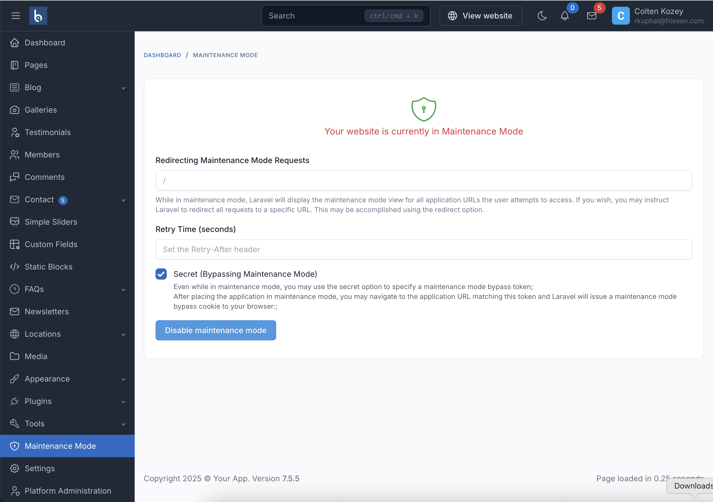

# Maintenance Mode Plugin for Botble CMS

## Overview
This plugin allows administrators to easily enable and disable maintenance mode for their Botble CMS website directly from the admin panel. When maintenance mode is enabled, regular visitors will see a maintenance page, while administrators can still access the site using a secret bypass URL.

This is a plugin for Botble CMS so you have to purchase Botble CMS first to use this plugin.
Purchase it here: [https://codecanyon.net/item/botble-cms-php-platform-based-on-laravel-framework/16928182](https://1.envato.market/LWRBY)

## Version Compatibility

- Version 1.0: Compatible with Botble CMS <= 5.12 (Laravel 7.x)
- Version 2.0: Compatible with Botble CMS >= 5.13 (Laravel 8.x)
- Version 3.0: Compatible with Botble CMS >= 7.5.0 (Laravel 11.x)

## Features

- Enable/disable maintenance mode with a single click
- Set a custom retry time for browsers
- Generate a secret bypass URL to access the site during maintenance
- User-friendly interface integrated into the admin panel
- Copy functionality for the bypass URL

## Installation
1. Download and rename folder `maintenance-mode-master` to `maintenance-mode`
2. Copy folder `maintenance-mode` into `/platform/plugins`
3. Go to Admin -> Plugins then activate plugin Maintenance Mode
4. Access the maintenance mode settings at Admin -> Platform Administration -> Maintenance Mode

## Usage

1. Navigate to the Maintenance Mode page in the admin panel
2. Configure the settings:
   - **Redirect URL**: Optional URL to redirect visitors to during maintenance
   - **Retry Time**: Time in seconds for browsers to wait before retrying to access the site
   - **Secret Bypass URL**: Enable to generate a secret URL that allows access during maintenance
3. Click the "Enable maintenance mode" button to activate
4. When maintenance mode is active, you can copy the secret bypass URL to access the site

## Important Notes
- If you can't access your site after enabling maintenance mode, you can manually delete the file **storage/framework/down** to turn off maintenance mode
- For more information about Laravel's maintenance mode, see the [official Laravel documentation](https://laravel.com/docs/10.x/configuration#maintenance-mode)

## Screenshots

## Contact Us
- Website: [https://botble.com](https://botble.com)
- Email: [contact@botble.com](mailto:contact@botble.com)
